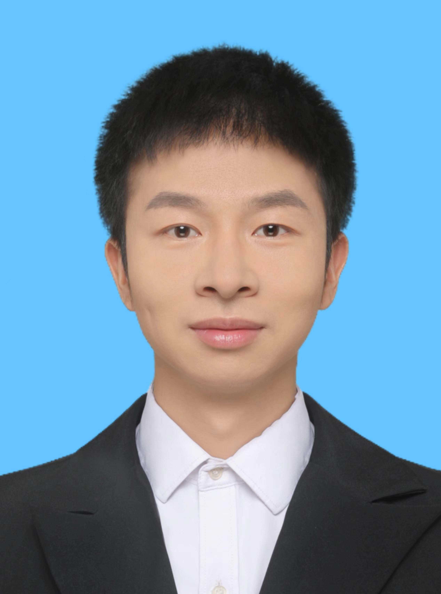

### Working Experience

- 2024.04-Present, Professor(特聘研究员),  [School of Mathematics](https://math.scu.edu.cn/),  [Sichuan University](https://www.scu.edu.cn/) .

- 2021.03-2024.03, Research fellow,  [Duke-NUS Medical School](https://www.duke-nus.edu.sg/), [National University of Singapore](https://nus.edu.sg/), Collaborative Supervisor: [Prof. Jin Liu](https://blog.nus.edu.sg/jinliu/) .

### Education

- 2015-2020, PhD in [Statistics](https://csr.swufe.edu.cn/),  [Center of Statistic Research](https://csr.swufe.edu.cn/) and [School of Statistics](https://stat.swufe.edu.cn/), [Southwestern University of Finance and Economics](https://www.swufe.edu.cn/),  Supervisor: [Prof. Huazhen Lin](https://csr.swufe.edu.cn/) .

- 2011-2015,  B.S. in [Mathmatics](http://math.swu.edu.cn/),  [School of Mathematics and Statistics](http://math.swu.edu.cn/), [Southwest University](http://www.swu.edu.cn/).

### Join our research group

We warmly welcome undergraduates majored in 

 - **mathematics** 
 
 - **statistics**
 
 - **computer science**
 
 - **compuational biology**
 
to join our research group, and also welcome you to apply for my graduate program.

If you are interested in joining our group, please send your CV to me!

### Contact

Wei Liu, Ph.D.  
[School of Mathematics](https://math.scu.edu.cn/)  
[Sichuan University](https://www.scu.edu.cn/)  
Tianyuan Mathematical Center in Southwest China, office: 217
Chengdu, Sichuan
Province, P.R.China

 [Email: liuwei8@scu dot edu dot cn](liuwei8@scu dot edu dot cn)  
 [GitHub: `feiyoung`](https://github.com/feiyoung)

